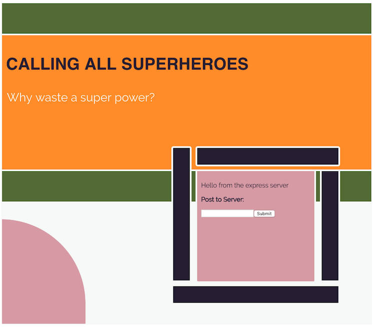

# Calling All Super Heroes

An app to support do-gooding Super Heroes to offer their free time in service of their communities.

`Why let a good super power go to waste?`

_Whatapalaver's Rationale_

---

I would like to demonstrate that I can rapidly pick up new technology and run with it. The plan is for this app to be based on API technology (as yet I am undecided whether to stick to RESTful routes or try something new and exciting like GraphQL), run on a Node.js backend with a React Native frontend so our Super Heroes can use their iPhones - or even Android if they are that way inclined.

_Work In Progess_

---

I have a new branch called starwars-animation that uses greensock to generate a starwars style intro animation. I'm not entirely happy about it but I have merged it to master. I need to do some research on positioning and z-index to restrict the visibility of the motion text. It's a bit cluttered at the moment.

_Work in Progress Screenshots_

---

Swiss Design inspired splash screen:

_User Stories_

---

- [ ] As a superhero, I would like to be able to offer my services to help my community
- [ ] As a superhero so I can exploit my particular set of skills, I would like to view a list of community members and see the tasks they need help with.
- [ ] As a superhero I would like to mark a task as completed.
- [ ] As a care in the community leader, I would like access to an admin portal where I can add new community members.
- [ ] As a care in the community leader, I would like to be able to assign required tasks to specific users.
- [ ] As a tech-savvy superhero, i would like to be able to access this service from my iPhone.

_Shout Outs_

---

- Great tutorial by [Esau Silva](https://medium.freecodecamp.org/how-to-make-create-react-app-work-with-a-node-backend-api-7c5c48acb1b0) that I have used over and over to assist with the setting up a CRA linked to a backend express app that will actually host on Heroku.
- If you get bizarre effects on your heroku deployment which appears not to have updated, it may be time to [clear down the cache](https://help.heroku.com/18PI5RSY/how-do-i-clear-the-build-cache).
- [StarWars style animation](https://medium.com/dev-red/tutorial-animate-the-opening-star-wars-crawl-in-a-react-app-with-greensock-bc55a5d05d24) with Greensock

## Available Scripts

In the project root directory, you can run:

### `npm dev`

This launches the backend node.js server and the frontend React app concurrently.
Open localhost/3000 for the frontend app
Open localhost/5000 for the backend

In the project client directory, you can run:

### `npm start`

Runs the app in the development mode. 
Open [http://localhost:3000](http://localhost:3000) to view it in the browser.

The page will reload if you make edits. 
You will also see any lint errors in the console.

### `npm test`

Launches the test runner in the interactive watch mode. 
See the section about [running tests](https://facebook.github.io/create-react-app/docs/running-tests) for more information.

### `npm run build`

Builds the app for production to the `build` folder. 
It correctly bundles React in production mode and optimizes the build for the best performance.

The build is minified and the filenames include the hashes. 
Your app is ready to be deployed!

See the section about [deployment](https://facebook.github.io/create-react-app/docs/deployment) for more information.
